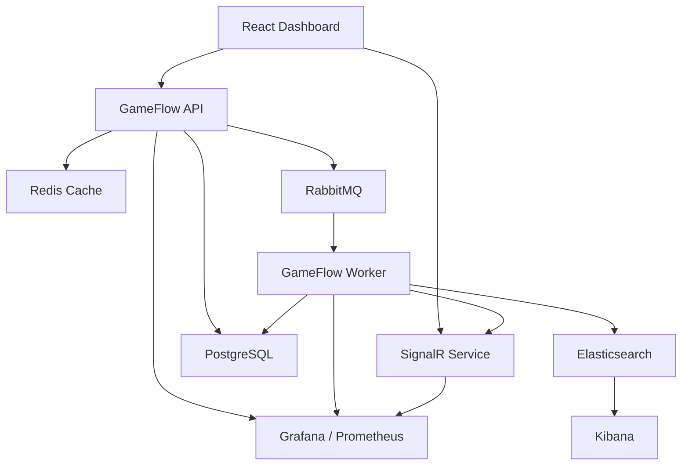
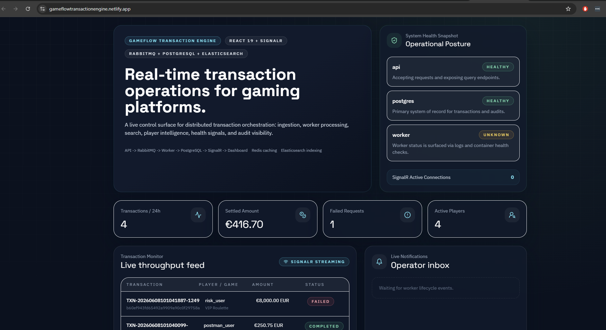
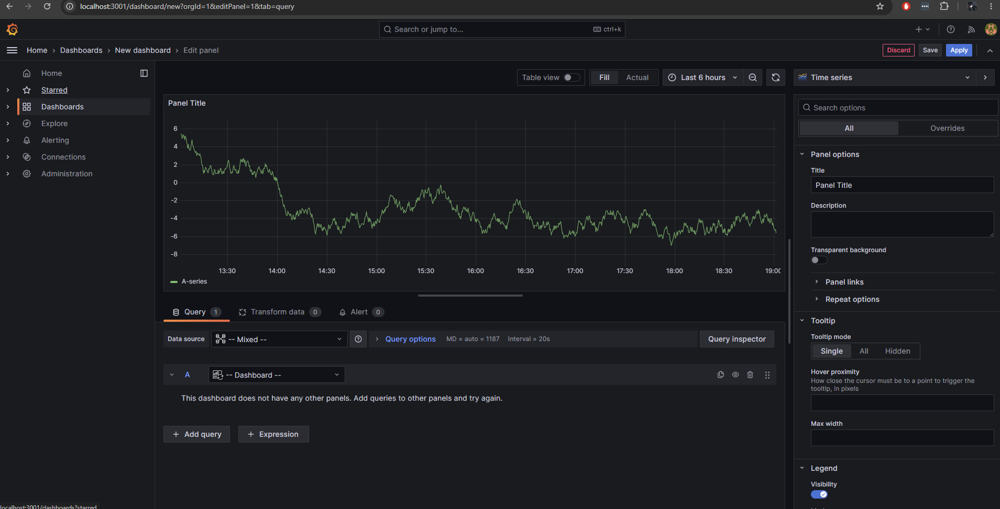
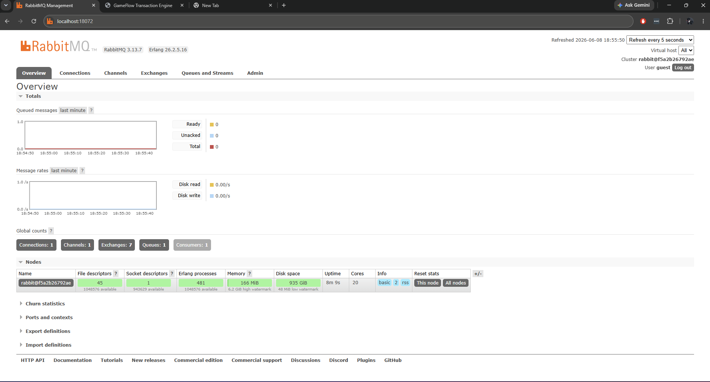

# GameFlow Transaction Engine

GameFlow Transaction Engine is a distributed transaction-processing portfolio project for gaming and iGaming systems. The goal is to present the kind of architecture an engineer might actually touch in a high-throughput platform team: transactional APIs, asynchronous workers, real-time operator visibility, search indexing, caching, observability, and container-first deployment.

## Why this project works

- .NET 8 backend split into API, worker, SignalR, and shared contracts/persistence
- PostgreSQL as the system of record for players, games, transactions, events, failures, and audits
- RabbitMQ as the handoff point between synchronous ingestion and asynchronous settlement
- Redis-backed player lookup caching
- Elasticsearch indexing for transaction-centric search workflows
- SignalR for live dashboard updates with no refresh loop
- xUnit validation coverage as the starting point for deeper service-level tests
- Docker, Kubernetes manifests, and GitHub Actions to tell a complete platform story


## Tech stack

| Layer | Technology | How it is used in this project |
| --- | --- | --- |
| Backend runtime | .NET 8 / ASP.NET Core | Powers the API, SignalR gateway, background worker, and shared application contracts |
| API layer | ASP.NET Core Web API | Exposes transaction ingestion, dashboard, player, and audit endpoints |
| Validation | FluentValidation | Validates incoming transaction requests before they enter the processing flow |
| Real-time messaging | ASP.NET Core SignalR | Broadcasts live transaction lifecycle updates to the dashboard |
| Background processing | .NET Worker Service | Consumes queued transaction commands and handles async settlement |
| ORM / data access | Entity Framework Core 8 | Manages persistence and query access through the shared `GameFlowDbContext` |
| Primary database | PostgreSQL | Stores players, games, transactions, transaction events, failures, and audit logs |
| Messaging broker | RabbitMQ | Decouples synchronous API writes from asynchronous worker processing |
| Cache | Redis | Supports player lookup caching in the API layer |
| Search | Elasticsearch | Indexes final transaction documents for operator-facing search workflows |
| Logging | Serilog | Provides structured application logging across backend services |
| API documentation | Swagger / Swashbuckle | Generates interactive API documentation for local and deployed environments |
| Frontend | React 19 + TypeScript | Builds the operator dashboard UI |
| Frontend build tool | Vite | Handles local development and frontend production builds |
| Frontend state / data | TanStack Query + Zustand | Manages server state, live-feed state, and dashboard client interactions |
| Frontend styling | Tailwind CSS | Drives utility-first styling for the dashboard UI |
| Frontend real-time client | `@microsoft/signalr` | Connects the React dashboard to the SignalR service |
| Testing | xUnit | Covers API validation and service-level backend behavior |
| Containers | Docker / Docker Compose | Runs the full local multi-service stack |
| Deployment / orchestration | Kubernetes, Render, Netlify | Supports container orchestration plus separate frontend/backend hosting targets |
| Observability | Prometheus, Grafana, Kibana | Provides metrics, dashboards, and log/search visibility around transaction processing |

## Demo Live

https://gameflowtransactionengine.netlify.app

## API Test

Local: `postman_collection-local-api.json`  
Live: `postman_collection-live-api.json`
=======
  ## Demo Live
  https://gameflowtransactionengine.netlify.app
  ## API Test
  - **Local API Collection:** [View Postman Collection](https://github.com/ggodin1981/gameflowtransactionengine_public/blob/main/postman_collection-local-api.json)
  - **Live API Collection:** [View Postman Collection](https://github.com/ggodin1981/gameflowtransactionengine_public/blob/main/postman_collection-live-api.json)


## Architecture Design



## Solution layout

```text
frontend/                 React 19 + Vite operator dashboard
src/GameFlow.Api/         ASP.NET Core API and query endpoints
src/GameFlow.Worker/      Background worker consuming RabbitMQ
src/GameFlow.SignalR/     Live updates gateway for dashboard clients
src/GameFlow.Shared/      Shared entities, DTOs, messaging contracts, DbContext
infra/docker/             Dockerfiles for local and CI image builds
infra/prometheus/         Prometheus scrape config
k8s/                      Kubernetes manifests
.github/workflows/        CI pipeline
```

## Implemented backend flow

1. `POST /api/transactions` accepts a transaction command.
   The request must include a unique `externalTransactionId` supplied by the caller for idempotency and duplicate protection.
2. The API upserts the player/game, persists a pending transaction, and records an audit entry.
3. The API publishes a `TransactionCommandMessage` to RabbitMQ.
4. The worker consumes the command, moves the transaction through processing, and settles or fails it.
5. The worker stores lifecycle events and audit logs in PostgreSQL.
6. The worker pushes the lifecycle update to the SignalR service.
7. The SignalR service broadcasts `transaction-updated` to connected dashboard clients.
8. The worker indexes the final transaction shape into Elasticsearch.

## Frontend features

- Dashboard KPIs for volume, failures, active players, queue depth, and service health
- Live transaction monitor merged from API data and SignalR events
- Search surface for player, transaction ID, game, and status
- Redis-oriented player lookup experience
- Audit log stream for operator traceability
- Live notification inbox for worker lifecycle events

## Local development

### Services

- API default URL: `http://localhost:5051`
- SignalR default URL: `http://localhost:5053`
- Frontend default URL: `http://localhost:5173`
- RabbitMQ management UI: `http://localhost:15672`
- Kibana: `http://localhost:5601`
- Grafana: `http://localhost:3001`

### Run with Docker Compose

```bash
docker-compose up --build
```

### Run services manually

Create local-only config files first:

```bash
cp src/GameFlow.Api/appsettings.Local.example.json src/GameFlow.Api/appsettings.Local.json
cp src/GameFlow.Worker/appsettings.Local.example.json src/GameFlow.Worker/appsettings.Local.json
```

```bash
dotnet run --project src/GameFlow.Api/GameFlow.Api.csproj
dotnet run --project src/GameFlow.SignalR/GameFlow.SignalR.csproj
dotnet run --project src/GameFlow.Worker/GameFlow.Worker.csproj
cd frontend && npm install && npm run dev
```

The public repo does not ship any committed PostgreSQL connection string. For local development, use the untracked `appsettings.Local.json` files above or set `Postgres__ConnectionString` in your environment. Docker Compose still injects `Postgres__ConnectionString` through container environment variables.

## Deployment notes

- Frontend target: Netlify
- Backend target: Render
- Database target: Supabase PostgreSQL
- Search/observability: self-managed Elasticsearch, Kibana, Grafana, Prometheus

## Portfolio talking points

- The synchronous request path is deliberately thin; real work happens asynchronously in the worker.
- The dashboard is transaction-centric rather than CRUD-centric, which mirrors operator tooling more closely.
- RabbitMQ, Redis, PostgreSQL, SignalR, and Elasticsearch are used to signal distributed-system thinking.
- The codebase is structured so you can grow it into outbox processing, retries, dead-letter handling, auth, and test projects next.

## UI Preview 




## Current limitations

- The code is organized for real implementation, but local restore and build still depend on the environment being able to create `obj/` and `bin/` artifacts normally.
- Prometheus/Grafana and Elasticsearch are wired at the deployment/config level; production-grade metrics, index templates, and dashboards would be the next iteration.
